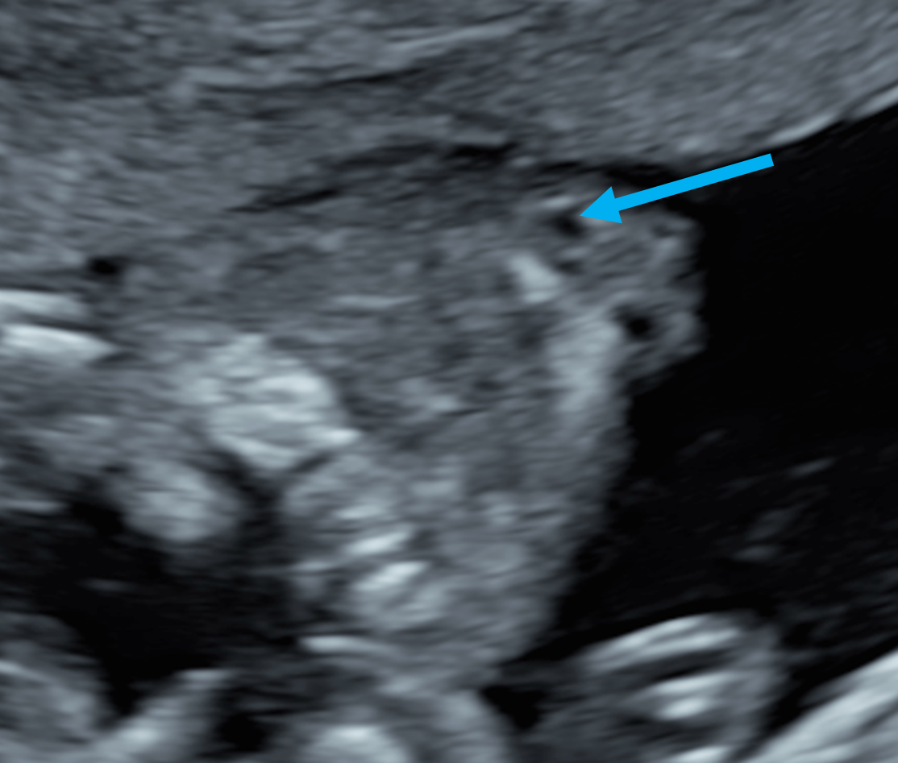
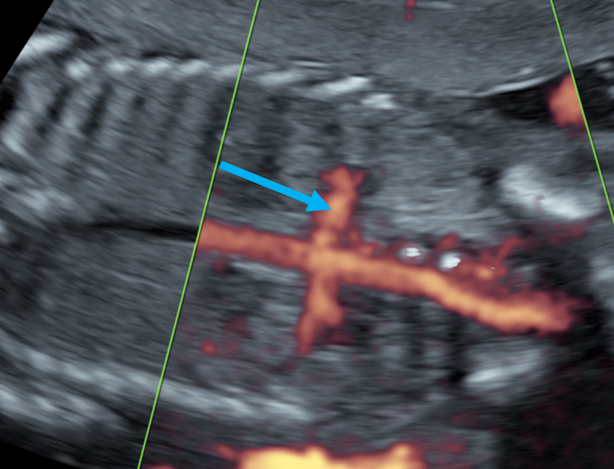
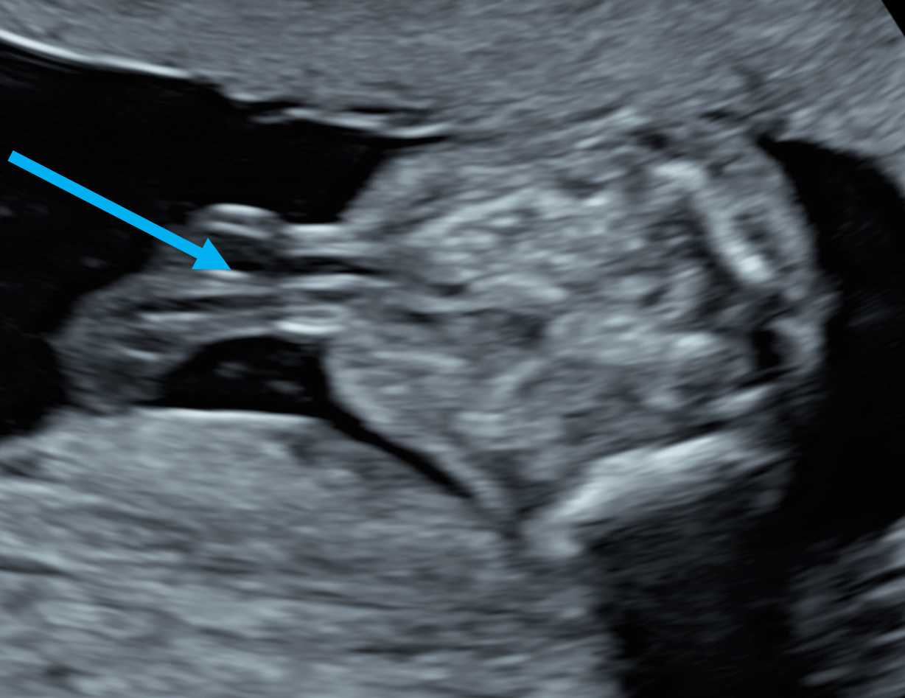
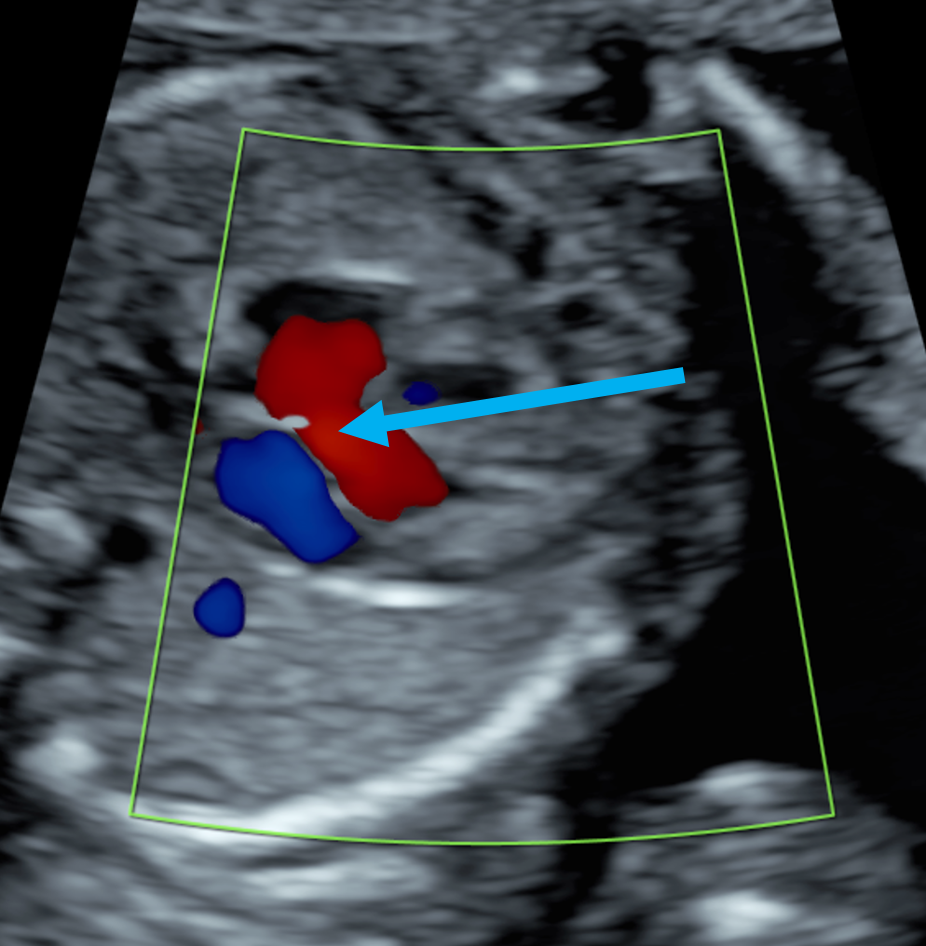

```{r setup, include=FALSE}
library(learnr)
`````

## Welcome 
blabla

###
Test your brain with some quiz

## Quiz 1

```{r q1, echo = FALSE}
knitr::include_graphics("images/q1_chin.png")
question(" What can you see?",
        answer("Chin", correct = TRUE),
        answer("Belly"),
        answer("Toe"),
        answer("Tummy"), 
        allow_retry = TRUE
        )
```

## Quiz 2
```{r q2, echo = FALSE}
knitr::include_graphics("images/q2_sacrum.png")
question(" What can you see?",
        answer("Belly"),
        answer("Sacrum", correct =TRUE),
        answer("Toe"),
        answer("Tummy"),
        allow_retry = TRUE
        )
```


## Quiz 3
```{r q3, echo = FALSE}
knitr::include_graphics("images/q3_cerebellum.png")
question(" What can you see?",
        answer("Belly"),
        answer("Sacrum"),
        answer("Toe"),
        answer("Cerebellum", correct= TRUE),
        allow_retry = TRUE
        )
```

## Quiz 4
```{r q4, echo = FALSE}

question(" What can you see?",
        answer("Belly"),
        answer("Sacrum"),
        answer("Toe"),
        answer("Nostril", correct= TRUE),
        allow_retry = TRUE
        )
```

## Quiz 5
```{r q5, echo = FALSE}
knitr::include_graphics("images/q5_heart.png")
question(" What can you see?",
        answer("Belly"),
        answer("Sacrum"),
        answer("Heart", correct= TRUE),
        answer("Toe"),
        allow_retry = TRUE
        )
```

## Quiz 6
```{r q6, echo = FALSE}

question(" What can you see?",
        answer("Renal artery", correct= TRUE),
        answer("Belly"),
        answer("Sacrum",),
        answer("Toe"),
        allow_retry = TRUE
        )
```

## Quiz 7 
```{r q7, echo = FALSE}

question(" What can you see?",
        answer("Belly"),
        answer("Umbilical cord", correct= TRUE),
        answer("Sacrum"),
        answer("Toe"),
        allow_retry = TRUE
        )
```

## Quiz 8
```{r q8, echo = FALSE}
knitr::include_graphics("images/q8_bladder.png")
question(" What can you see?",
        answer("Belly"),
        answer("Sacrum"),
        answer("Toe"),
        answer("Bladder", correct= TRUE),
        allow_retry = TRUE
        )
```

## Quiz 9 
```{r q9, echo = FALSE}
knitr::include_graphics("images/q9_heel.png")
question(" What can you see?",
        answer("Belly"),
        answer("Heel", correct= TRUE),
        answer("Sacrum"),
        answer("Toe"),
        allow_retry = TRUE
        )
```

## Quiz 10
```{r q10, echo = FALSE}
knitr::include_graphics("images/q10_kidney.png")
question(" What can you see?",
        answer("Belly"),
        answer("Sacrum"),
        answer("Toe"),
        answer("Kidney", correct= TRUE),
        allow_retry = TRUE
        )
```

## Quiz 11
```{r q11, echo = FALSE}
knitr::include_graphics("images/q11_big_toe.png")
question(" What can you see?",
        answer("Belly"),
        answer("Sacrum"),
        answer("Toe", correct= TRUE),
        answer("Kidney"),
        allow_retry = TRUE
        )
```

## Quiz 12
```{r q12, echo = FALSE}
knitr::include_graphics("images/q12_little_finger.png")
question(" What can you see?",
        answer("Toe"),
        answer("Sacrum"),
        answer("Finger", correct= TRUE),
        answer("Kidney"),
        allow_retry = TRUE
        )
```

## Quiz 13
```{r q13, echo = FALSE}

question(" What can you see?",
        answer("Toe"),
        answer("Aorta", correct= TRUE),
        answer("Sacrum"),
        answer("Kidney"),
        allow_retry = TRUE
        )
```

## Quiz 14
```{r q14, echo = FALSE}
knitr::include_graphics("images/q14_bladder.png")
question(" What can you see?",
        answer("Bladder", correct= TRUE),
        answer("Toe"),
        answer("Sacrum"),
        answer("Kidney"),
        allow_retry = TRUE
        )
```
